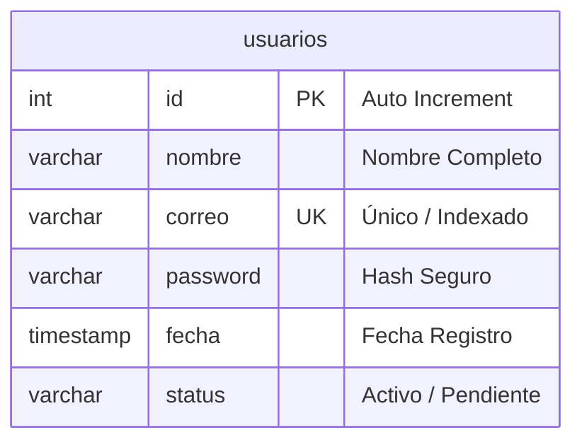
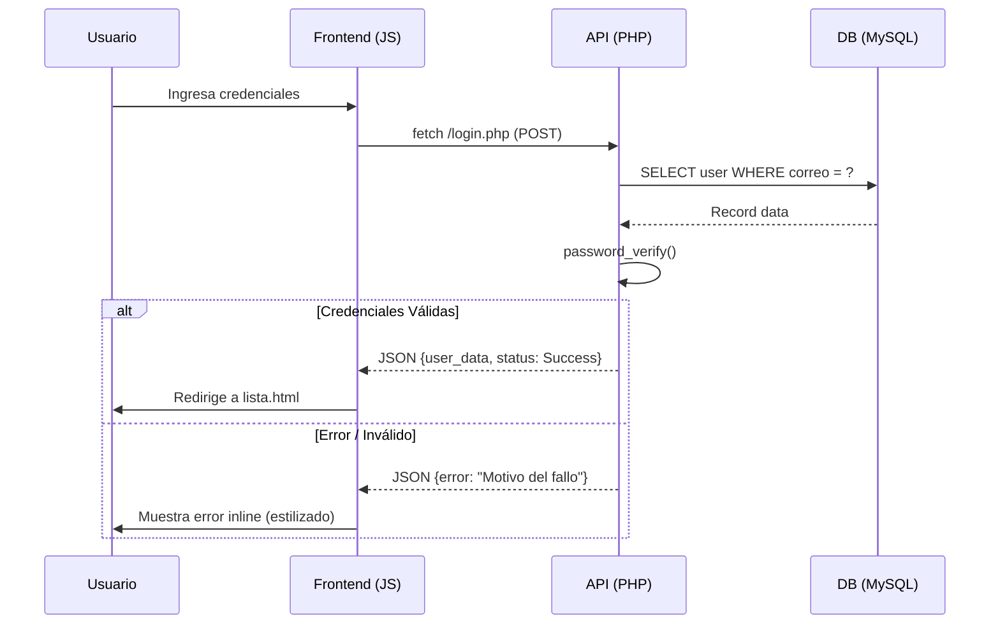

# Sistema de Registro - Modern Zen Platform

Una plataforma web de alto rendimiento y estética premium diseñada para la gestión profesional de identidades. Este proyecto ha evolucionado de una solución local a una arquitectura robusta de **Backend con PHP y MySQL**, manteniendo su esencia visual "Modern Zen".


## ✨ Características Principales

-   **Backend Real**: Migración completa de LocalStorage a una base de datos MySQL relacional.
-   **Seguridad**: Encriptación de contraseñas mediante `password_hash` de PHP.
-   **UI Refinada**: Mensajes de error y validaciones integrados directamente en los formularios (`inline`), eliminando las alertas intrusivas del navegador.
-   **Gestión de Datos (CRUD)**: Sistema completo para listar, crear, editar y eliminar usuarios con persistencia real.
-   **Diseño Modern Zen**: Interfaz de alta gama basada en `glassmorphism`, tipografía Inter y una paleta de colores sofisticada.

---

## 📊 Arquitectura del Sistema

### Diagrama Entidad-Relación (ER)
Este diagrama representa la estructura de datos centralizada en nuestro servidor MySQL.



### Diagrama UML de Secuencia (Flujo de Autenticación)
Representación del proceso de interacción entre el cliente y el servidor durante el inicio de sesión.



---

## 🛠️ Tecnologías Utilizadas

-   **Frontend**: HTML5 Semántico, CSS3 (Vanilla con variables), JavaScript ES6+.
-   **Backend**: PHP 8 (PDO para seguridad contra SQL Injection).
-   **Base de Datos**: MySQL (Motor InnoDB).
-   **Estilos**: Glassmorphism, Micro-animaciones, Flex/Grid Layout.

---

## 📂 Estructura del Proyecto

```text
SistemaRegistro/
├── backend/
│   ├── api/
│   │   ├── login.php        # Endpoint de autenticación
│   │   ├── registro.php     # Endpoint de creación
│   │   └── usuarios.php     # Gestión CRUD (GET, PUT, DELETE)
│   ├── config.php           # Configuración de conexión PDO
│   └── db.sql               # Esquema de la base de datos
├── public/
│   └── template/
│       ├── index.html       # Landing Page
│       ├── registro.html    # Formulario de Registro
│       ├── login.html       # Formulario de Acceso
│       └── lista.html       # Dashboard / Listado
├── static/
│   ├── css/
│   │   └── styles.css       # Sistema de diseño integral
│   ├── js/
│   │   └── main.js          # Lógica de conexión y UI
│   └── image/               # Recursos visuales
└── index.php                # Punto de entrada / Redireccionamiento
```

---

## 🚀 Instalación y Configuración

### 1. Requisitos
-   Servidor Local (XAMPP, WAMP o Laragon).
-   PHP 7.4 o superior.
-   MySQL 5.7 o superior.

### 2. Configuración de Base de Datos
1.  Abre **phpMyAdmin**.
2.  Crea una base de datos llamada `sistema_registro`.
3.  Importa el archivo localizado en `backend/db.sql`.

### 3. Despliegue
1.  Clona el repositorio en tu carpeta de servidor (ej. `htdocs`).
2.  Asegúrate de que la ruta sea `http://localhost/SistemaRegistro/`.
3.  Configura tus credenciales de MySQL en `backend/config.php` si es necesario.

---

**Desarrollado por Andres Garcia**
*Ingeniería e Innovación en cada línea de código.*
